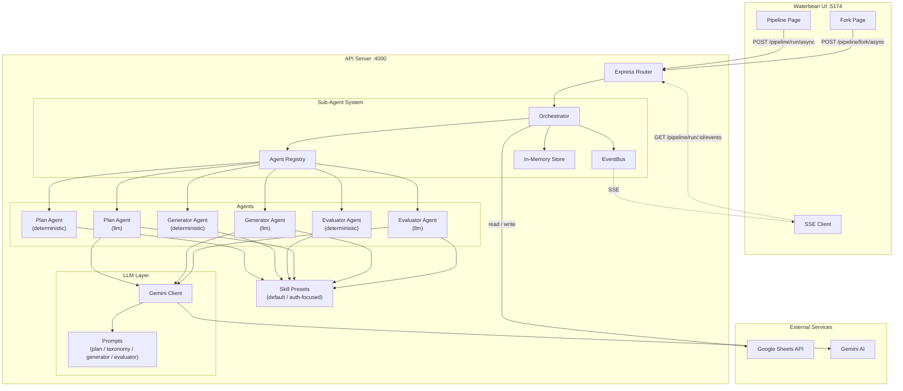
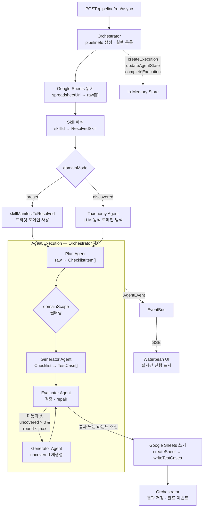

# Partner Center

Google Sheets 기능 목록으로부터 QA Test Case를 자동 생성하는 도구입니다.

## 프로젝트 구조

```
partner-center/
├── api/                        # Express 백엔드 — TC 생성 파이프라인
│   └── src/
│       ├── agents/             #   Sub-Agent 구현 (Orchestrator, EventBus, Registry, Store)
│       ├── config/             #   환경 변수 · Google Sheets 클라이언트
│       ├── llm/                #   Gemini LLM 클라이언트 · 프롬프트 모듈
│       ├── pipeline/           #   Plan · Generator · Evaluator 로직
│       ├── routes/             #   API 라우트 (동기/비동기/SSE)
│       ├── sheets/             #   Sheets 읽기 · 쓰기
│       ├── skills/             #   스킬 프리셋 (도메인 키워드 · TC 템플릿)
│       └── types/              #   타입 정의 (Pipeline, TC, Fork)
├── waterbean/                  # React SPA — TC Harness (파이프라인 실행 UI)
│   └── src/
│       ├── features/
│       │   ├── pipeline/       #   파이프라인 실행 · 결과 뷰
│       │   └── fork/           #   Fork 비교 실행 · 결과 뷰
│       └── shared/             #   공통 UI · API 클라이언트 · SSE · i18n
└── docs/                       # 매뉴얼 · 설계 문서
```

| 워크스페이스 | 포트 | 스택 | 설명 |
|---|---|---|---|
| `api` | 4000 | Express 5 · Google Sheets API · Gemini AI · Zod | TC 생성 파이프라인 API 서버 |
| `waterbean` | 5174 | React 19 · Vite 8 · Tailwind 4 | Pipeline / Fork 실행 UI |

## 시작하기

### 사전 준비

- Node.js 20+
- Google Cloud 서비스 계정 키 파일 (Sheets API 권한)
- Gemini API 키 (LLM 모드 사용 시)

### 설치

```bash
npm install
```

### 환경 변수

프로젝트 루트에 `.env` 파일을 생성합니다. `api/.env.example`을 참고하세요.

```bash
cp api/.env.example api/.env
```

| 변수 | 설명 | 기본값 |
|---|---|---|
| `GOOGLE_SERVICE_ACCOUNT_KEY_PATH` | 서비스 계정 키 JSON 경로 (api/ 기준 상대경로) | `../sa.json` |
| `PORT` | API 서버 포트 | `4000` |
| `GEMINI_API_KEY` | Gemini API 키 (LLM 에이전트 필수) | — |
| `GEMINI_MODEL` | 사용할 Gemini 모델 | `gemini-2.5-flash-lite` |
| `LLM_MAX_TOKENS` | LLM 최대 출력 토큰 | `8192` |
| `LLM_TEMPERATURE` | LLM Temperature | `1.0` |
| `LLM_TIMEOUT_MS` | LLM 요청 타임아웃 (ms) | `30000` |

### 개발 서버 실행

```bash
# 전체 (api + waterbean 동시 실행)
npm run dev

# 개별 실행
npm run dev:api        # API 서버
npm run dev:waterbean  # TC Harness UI
```

### 빌드

```bash
npm run build   # 전체 워크스페이스 빌드
npm run lint    # 전체 워크스페이스 린트
```

## 시스템 구성도



## 아키텍처

### Sub-Agent 시스템

파이프라인의 각 단계(Plan, Generator, Evaluator)는 독립적인 **에이전트**로 구현되며, 두 가지 구현체를 선택할 수 있습니다.

| 구현체 | 설명 |
|---|---|
| `deterministic` | 규칙 기반 처리 (키워드 매칭, 템플릿 조합) |
| `llm` | Gemini AI 기반 처리 (실패 시 deterministic 폴백) |

### 핵심 모듈

| 모듈 | 위치 | 역할 |
|---|---|---|
| Orchestrator | `api/src/agents/orchestrator.ts` | 에이전트 흐름 제어, 폴백 라운드 관리 |
| EventBus | `api/src/agents/event-bus.ts` | 에이전트 간 이벤트 전파, SSE 브리지 |
| Agent Registry | `api/src/agents/registry.ts` | 에이전트 동적 등록 · 조회 |
| In-Memory Store | `api/src/agents/store.ts` | 실행 상태 저장 (TTL 기반 GC) |
| Gemini Client | `api/src/llm/gemini-client.ts` | `@google/generative-ai` SDK 래퍼, Zod 검증, 자동 재시도 |

### domainMode

요청 본문 `domainMode`로 도메인 정의 방식을 고릅니다 (기본값 `preset`).

| 값 | 설명 |
|---|---|
| `preset` | 스킬 프리셋(`default`, `auth-focused` 등)의 고정 7도메인을 [`ResolvedSkill`](api/src/skills/resolved-skill.ts)로 변환해 사용 |
| `discovered` | **Taxonomy** 단계에서 LLM이 시트 샘플을 보고 도메인 id·키워드·템플릿·최소 세트를 구조화 생성. 우선순위·심각도 규칙은 베이스 스킬에서 유지. **`domainScope`는 `ALL`만 허용**, `GEMINI_API_KEY` 필수 |

## 파이프라인 흐름



- **Orchestrator**: 파이프라인의 전체 생명주기를 관리합니다. `pipelineId` 생성, 시트 읽기, Skill 해석, 에이전트 순차 실행, Fallback 라운드 제어, 결과 저장 및 완료 이벤트 발행까지 모든 흐름을 조율합니다. 에러 발생 시 실패 결과를 기록하고 파이프라인 종료 이벤트를 보장합니다.
- **Plan**: 시트의 기능 목록을 파싱하여 도메인별 체크리스트 항목을 구성합니다. `domainScope`로 특정 도메인만 필터링할 수 있습니다.
- **Generator**: Skill 규칙 또는 LLM을 통해 TC를 생성합니다.
- **Evaluator**: 스키마, 필수값, 도메인 최소 세트, 커버리지, 중복을 검증합니다. LLM 모드에서는 자동 수리(repair)도 수행합니다.
- **Fallback**: 미통과 시 `uncoveredItems`를 Generator에 재투입하여 보완 생성 후 재검증합니다. `maxFallbackRounds`까지 반복합니다.

비동기 실행 시 각 에이전트의 진행 상태가 **SSE(Server-Sent Events)** 로 실시간 전달되어 Waterbean UI에서 확인할 수 있습니다.

## 스킬 프리셋

`api/src/skills/presets/` 디렉터리의 JSON 파일로 TC 생성 전략을 정의합니다.

| 프리셋 | 설명 |
|---|---|
| `default.json` | 7개 도메인 범용 (Auth, Payment, Content, Membership, Community, Creator, Admin) |
| `auth-focused.json` | Auth·Security 강화 프리셋 |

각 프리셋은 다음을 포함합니다:
- **domainKeywords** — 도메인 분류용 키워드
- **templates** — TC 생성 Few-Shot 템플릿
- **domainMinSets** — 도메인별 TC Type 최소 수량
- **priorityRules / severityRules** — 우선순위 · 심각도 자동 부여 규칙

`GET /pipeline/skills`로 등록된 스킬 목록을 조회할 수 있습니다.

## API 엔드포인트

### 공통

| 메서드 | 경로 | 설명 |
|---|---|---|
| `GET` | `/health` | 헬스체크 |
| `GET` | `/pipeline/skills` | 등록된 스킬 목록 조회 |
| `GET` | `/pipeline/agents` | 등록된 에이전트 목록 조회 |

### Pipeline

| 메서드 | 경로 | 설명 |
|---|---|---|
| `POST` | `/pipeline/run` | 동기 파이프라인 실행 |
| `POST` | `/pipeline/run/async` | 비동기 파이프라인 실행 (pipelineId 반환) |
| `GET` | `/pipeline/run/:id/events` | SSE 실시간 진행 스트림 |
| `GET` | `/pipeline/run/:id/result` | 파이프라인 결과 조회 |
| `GET` | `/pipeline/run/:id/agents` | 에이전트 상태 조회 |

### Fork

| 메서드 | 경로 | 설명 |
|---|---|---|
| `POST` | `/pipeline/fork` | 동기 Fork 실행 (복수 변형 병렬 비교) |
| `POST` | `/pipeline/fork/async` | 비동기 Fork 실행 (forkId 반환) |
| `GET` | `/pipeline/fork/:id/events` | Fork SSE 실시간 진행 스트림 |
| `GET` | `/pipeline/fork/:id/result` | Fork 결과 조회 |

## i18n

`waterbean`은 `react-i18next` 기반 다국어를 지원합니다.

- 지원 언어: 한국어(ko, 기본), 영어(en)
- 번역 파일: `waterbean/src/shared/locales/ko.json`, `en.json`
- 언어 전환: 헤더 우측 버튼

## 문서

- [QA TC 시트 매뉴얼](docs/QA-TC-시트-매뉴얼.md)
- [Sub-Agent 설계 로드맵](docs/TODO-sub-agent.md)
